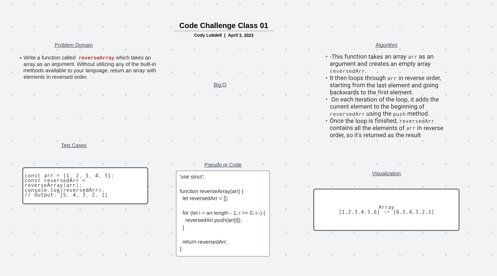

# Data Structures and Algorithms

## 401 Data Structures, Code Challenges

# Challenge Title
<!-- Code Challenge: Class 01 (array-reverse) -->

## Whiteboard Process

## Approach & Efficiency
<!-- I used a basic reverse function that I had used previously in REPLIT-->

## Solution

'use strict';

function reverseArray(arr) {
  let reversedArr = [];

  for (let i = arr.length - 1; i >= 0; i--) {
    reversedArr.push(arr[i]);
  }

  return reversedArr;
}

const arr = [1, 2, 3, 4, 5];
const reversedArr = reverseArray(arr);
console.log(reversedArr);

// Output: [5, 4, 3, 2, 1]
